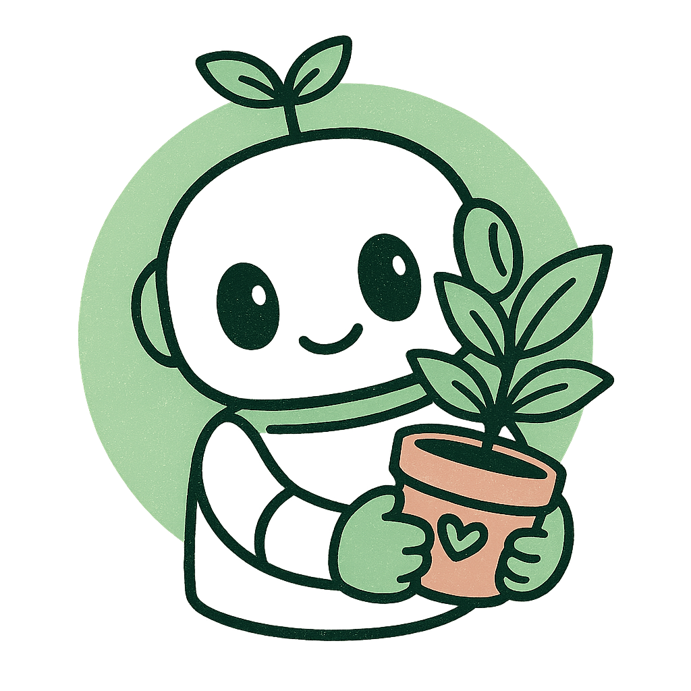
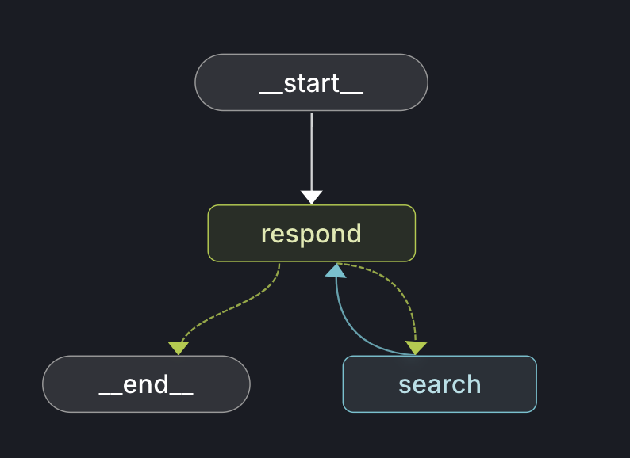

# Plant Bot



A 🌱 houseplant recommendation bot with 🖼️ 🔍 image search capabilities that demonstrates Langgraph and Slack integration using langgraph2slack.

## Quick Start

### 1. Install Dependencies

```bash
uv venv
source .venv/bin/activate  # or `.venv\Scripts\activate` on Windows
uv pip install -e ".[dev]"
```

### 2. Set Up Environment

Copy `.env.example` to `.env` and fill in your API keys:

```bash
cp .env.example .env
```

Required keys:
- `ANTHROPIC_API_KEY` - Get from https://console.anthropic.com
- `TAVILY_API_KEY` - Get from https://tavily.com
- `SLACK_BOT_TOKEN` - Get from https://api.slack.com/apps
- `SLACK_SIGNING_SECRET` - Get from https://api.slack.com/apps
- `ASSISTANT_ID` - Set to `plant_agent` (the graph name)
- `LANGGRAPH_URL` - Set to `http://localhost:2024` for local dev

### 3. Test Locally with Streamlit

```bash
streamlit run streamlit_plant.py --server.port 8503
```

Open http://localhost:8503 and ask questions like:
- "What are some easy houseplants for beginners?"
- "Show me what a monstera deliciosa looks like"
- "How much light does a pothos need?"
- "I want a low-light plant for my bathroom"

### 4. Deploy to Slack

#### Local Development

1. Start LangGraph dev server:
   ```bash
   langgraph dev
   ```

2. In another terminal, start ngrok on the same port as langgraph:
   ```bash
   ngrok http 2024
   ```

3. Update your Slack app's Event Subscriptions URL to:
   ```
   https://your-ngrok-url.ngrok.io/events/slack
   ```

4. Test in Slack by DMing the bot or @mentioning it in a channel!

#### Production Deployment

1. Deploy to LangGraph Platform:
   ```bash
   langgraph deploy
   ```

2. Update your Slack app's Event Subscriptions URL to:
   ```
   https://your-deployment.langgraph.app/events/slack
   ```

3. copy `.env` to environmental variables on Langgraph (remove `LANGGRAPH_URL`).

## How to Connect to Slack

1. **Create Slack App**: Use [slack_manifest.yaml](./slack_manifest.yaml) to create your app at https://api.slack.com/apps

2. **Add tokens to `.env`** (see [.env.example](./.env.example)):
   - `SLACK_BOT_TOKEN` - From "OAuth & Permissions"
   - `SLACK_SIGNING_SECRET` - From "Basic Information"

3. **Update Event Subscriptions URL** in your Slack app settings with your ngrok/deployment URL (see step 4 above)

That's it! The [slack_server.py](./slack_server.py) integration (just 4 lines!) handles all Slack events, streaming, threading, and image rendering.

## How It Works



The bot uses **conditional routing** for speed:
1. User asks about plants → Claude responds
2. If images needed → Tavily searches → Claude adds images
3. Otherwise → Done (fast!)

All responses stream token-by-token for low latency.

## Learn More

- [langgraph2slack Documentation](../../README.md)
- [LangGraph Documentation](https://langchain-ai.github.io/langgraph/)
